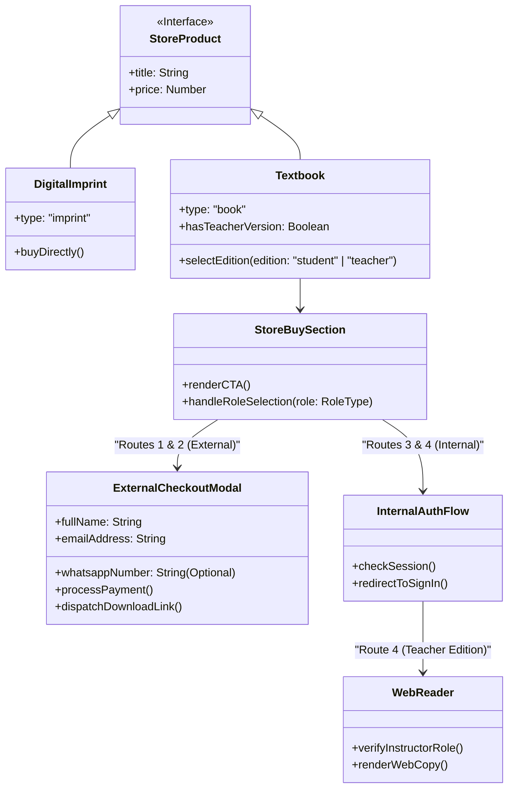
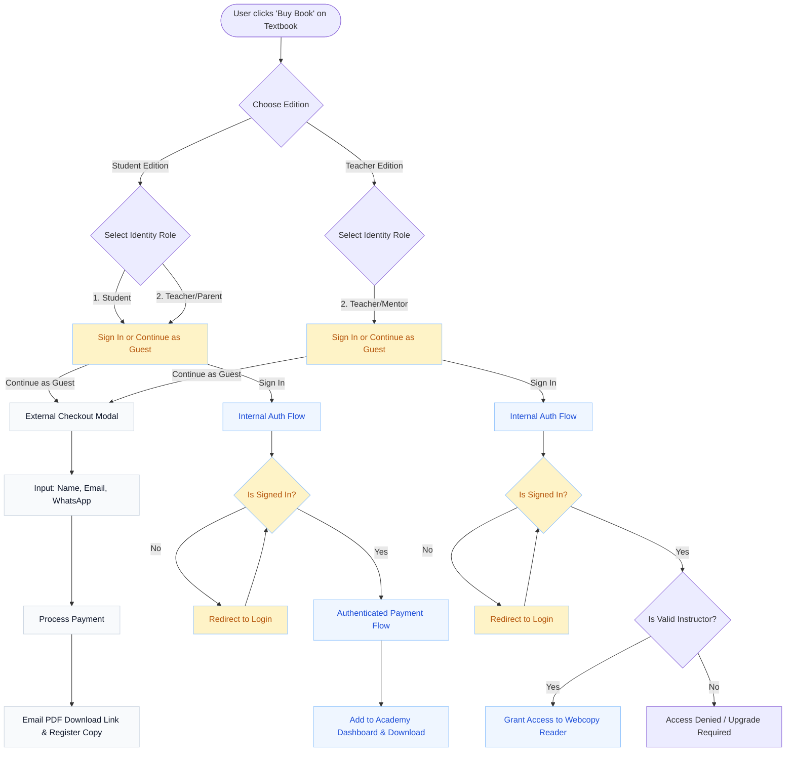

# Hexadigitall Textbook Ecosystem: Architecture & Flow Guide

This document outlines the architectural and behavioral differences between the **Textbooks** ecosystem and the **Imprints** ecosystem within the Hexadigitall store, specifically detailing the user journey based on the selected edition and the user's role.

---

## 1. Ecosystem Distinctions

| Feature | Digital Imprints | Educational Textbooks |
| :--- | :--- | :--- |
| **Versions** | Single version for all users. | Dual versions: **Student Edition** & **Teacher Edition**. |
| **Target Audience** | General public, professionals. | External learners/educators & Internal Hexadigitall Academy members. |
| **Acquisition Flow** | Simple, direct checkout (Buy Book). | Role-based branching (External vs. Internal Auth). |
| **Fulfillment** | PDF Download via email link. | Download (External) OR Webcopy/Account Dashboard (Internal). |

---

## 2. Role Definitions for Textbooks

When a user attempts to acquire a textbook, they must identify their role. The system categorizes these into four distinct paths:

### External Users (Unregistered / Public)
1. **Student** (Self-study, external)
2. **Teacher / Mentor / Parent** (Buying for an external student or personal teaching)
   - **Flow:** These users are presented with a specific **External Checkout Modal**.
   - **Required Details:** Full Name, Email Address, WhatsApp Number (Optional).
   - **Fulfillment:** Payment -> Download PDF -> Prompt to register copy.

### Internal Users (Hexadigitall Academy)
3. **Student (Hexadigitall)**
   - **Flow:** Prompted to sign in. Once authenticated, they proceed to checkout for the **Student Edition** linked directly to their academy account.
4. **Teacher / Mentor (Hexadigitall)**
   - **Flow (Teacher Edition):** Prompted to sign in. Once authenticated, they are granted immediate access to the **Instructor Webcopy** (no payment required for their teaching materials).
   - **Flow (Student Edition):** If they wish to purchase the Student Edition, they follow the internal authenticated checkout flow.

---

## 3. Structural UML (Class/Component Architecture)

The following diagram illustrates how the components and data structures relate to one another to fulfill this requirement.

---

## 4. Behavioral UML (User Flow / Activity Diagram)

This flowchart traces the exact logic a user experiences from the moment they click on a textbook CTA.

---

## 5. Implementation Roadmap

To align the current codebase with this architecture, we will execute the following steps sequentially:

1. **Update `TwoStepCheckoutModal.tsx` & Create `ExternalCheckoutModal.tsx`:** 
   - Separate the current monolithic modal. We need an explicit `ExternalCheckoutModal` capturing Name, Email, and WhatsApp.
2. **Refactor `StoreBuySection.tsx`:**
   - Modify the UI to first ask for the **Edition** (Student vs Teacher).
   - Upon selecting an edition, present a simplified choice: "Sign In" (primary) and "Continue as Guest" (secondary).
   - Clicking "Sign In" will trigger the `signIn()` flow.
   - "Continue as Guest" will open the `ExternalCheckoutModal`.
3. **Handle Authenticated Routing:**
   - Ensure that if a user signs in, they are brought back to the correct context.
   - For Hexadigitall Teachers accessing the Teacher Edition, route them directly to `/store/[slug]/reader` if their session verifies their instructor status.
4. **Clean up Imprints Flow:**
   - Ensure Imprints (which don't have Teacher/Student versions) bypass this complex role selection and jump straight to a simplified checkout.